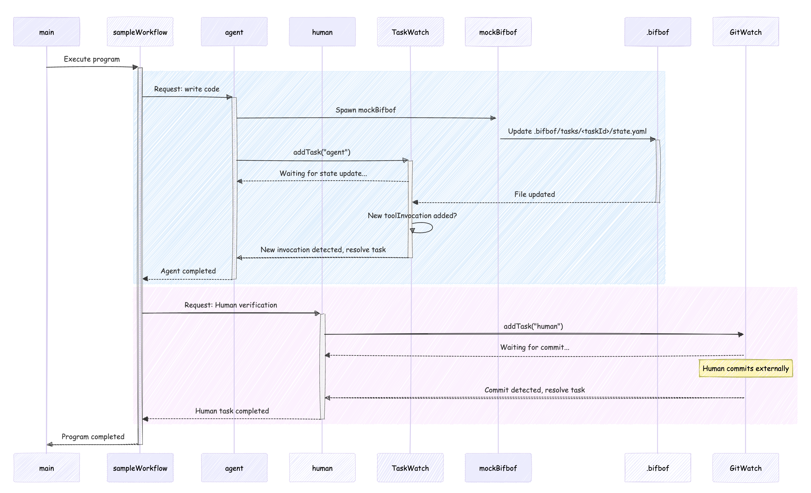

# Transpiler for bifbof

*transpiler is probably wrong term anyway...*

This is a simple tool to write agentic workflows for code assitants.

## Existing programming model for bifbof


## Why this transplier is a bit better

Workflow is defined with typescript and is "transpiled" into to a series of calls to bifbof.
Since bifbof modifes the state of the repo and every bifbof execution is terminated with state update (optionally git update), the tool monitors state updates to pass the control back to our program.

> [chokidar](https://github.com/paulmillr/chokidar) library is used to watch over git files 

Here is what happens with a simple sample workflow:

```ts
async function sampleWorkflow() {
  await agent("Write code");
  await human("Please check");
}
```

At a high-level, this workflow calls the agent via bifbof, waits until a new state update is caught and then resolves the promise. Then, we call human developer and wait for external commit and once it is resolved, terminate the program.

In detail, here is the same workflow:



## Agents vs tools

Agent is specifc case of the tool as per original programming model.

## Run this

Before anything, install the dependencies:
```ts
bun install
```

To run sample worfklows:
```ts
bun main.ts
```

Last workflow requires human input, so you would need to commit something for it to terminate.

To run an example of synthetic workflow generated for evaluation:

```ts
bun sample_synthetic_workflow.ts
```

To run tests, including end-to-end test using synthetic workflow:
```ts
bun test
```

## Evaluation

Tests run in temporary git repos. For now, these repos are not removed for debugging purposes. There is code to generate synthetic workflows with desired features and of desired length. Current end-to-end test generates 10 workflows with all features - in the future this will get refactored into separate tests (not as flaky) for separate features.

## Potential for improvement
1. **More rigid connector to the real bifbof CLI**: right now it is mocked and the focus is on demonstrating the flexibility of the appraoch
2. **Better monitoring for git commits**: right now we do not mark any commits as coming from the specifc program execution and when we watch out for new commits we can catch commits that we are not interested in (coming from other program execution/human developer work). This also stops us from writing concurrent code within our program. The solution would be to mark commits with some unique message that would be added to all commit messages originated from one bifbof execution. This way GitWatch will only resolve tasks that match the correct commit identifier
3. **More flexible syntethic test workflow generator**: just cover more corner cases